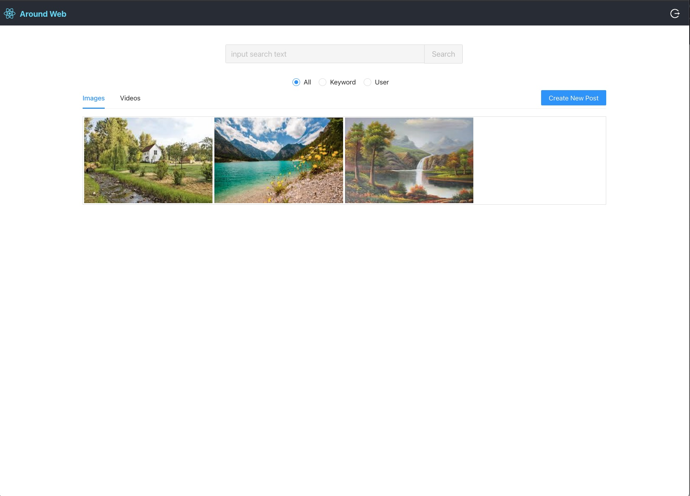

# Around
Description: a social app which can search the post information, photo, video by the user. The user can also post the image and video.

## task
* Designed and implemented a social network web application with React JS.
* Implemented features for users to create and browse posts and support search nearby posts.
* Improved the authentication using token-based registration/login/logout flow with React Router v4 and server-side user authentication with JWT.
Backend
* Launched a scalable web service in Go to handle posts and deployed to Google Cloud (Google App Engine) 
* deploy the frontend on the amazon amplify

## deploy at
https://main.d2rpjckf5nqy94.amplifyapp.com

## Effect

## Problem:
The elasticsearch currently only return 10 result

## To do:
support to return more result.

 
